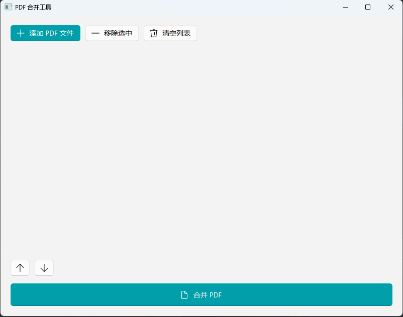

# PDF 合并工具

<div align="center">
  
</div>

## 📋 项目简介

一款简洁易用、界面美观的PDF文件合并工具，同时支持现代化图形界面和高效命令行操作，满足不同场景下的PDF处理需求。

**注意：作为一个临时使用的工具，本项目大部分代码由 AI 生成，可能不会提供后续维护。**

## ✨ 核心特性

### 🎨 现代化图形界面
- 采用 Fluent Design 设计风格，视觉体验流畅优雅
- 支持文件拖放操作，简化文件添加流程
- 直观的文件顺序调整（上移/下移）功能
- 支持浅色/深色主题自动切换
- 精心设计的操作反馈和错误提示

### 💻 高效命令行模式
- 支持批量PDF文件合并
- 兼容通配符（如 `*.pdf`）批量匹配
- 提供丰富的命令行参数和帮助文档
- 适合集成到自动化工作流或脚本中

## 🚀 快速开始

### 1. 安装依赖

确保您已安装 Python 3.12 或更高版本，然后执行：

```bash
pip install -r requirements.txt
```

### 2. 运行程序

#### 图形界面模式（推荐）

```bash
python pdf_merger.py
```

**操作步骤：**
1. **添加文件**：点击"添加 PDF 文件"按钮或直接将PDF文件拖放到窗口中
2. **调整顺序**：使用"上移"和"下移"按钮调整文件合并顺序
3. **合并文件**：点击"合并 PDF"按钮，选择输出文件保存位置
4. **完成**：等待合并完成，查看结果

#### 命令行模式

基本语法：
```bash
python pdf_merger.py -o 输出文件.pdf 文件1.pdf 文件2.pdf ...
```

**使用示例：**

```bash
# 合并多个指定的PDF文件
python pdf_merger.py -o merged.pdf document1.pdf report.pdf presentation.pdf

# 使用通配符合并当前目录下所有PDF文件
python pdf_merger.py -o all_documents.pdf *.pdf

# 合并特定目录下的PDF文件
python pdf_merger.py -o project_files.pdf ./docs/*.pdf

# 查看完整帮助信息
python pdf_merger.py --help
```

## 📦 打包为可执行文件

对于Windows用户，提供了便捷的打包脚本，可以生成无需Python环境的独立可执行文件：

### 打包为EXE文件 (需要安装nuitka)
```bash
build.bat
```
```

打包完成后，可执行文件位于 `dist` 目录中。

## ⚙️ 环境要求
- **操作系统**：Windows 10/11
- **Python 版本**：3.12 或更高

## 📚 主要依赖
- **PySide6**：Qt for Python，用于构建跨平台图形界面
- **QFluentWidgets**：提供现代化的Fluent Design风格UI组件
- **pypdf**：PDF文件处理库
- **nuitka**：用于将Python代码打包为独立的可执行文件

---

Made with ❤️ for PDF file management
